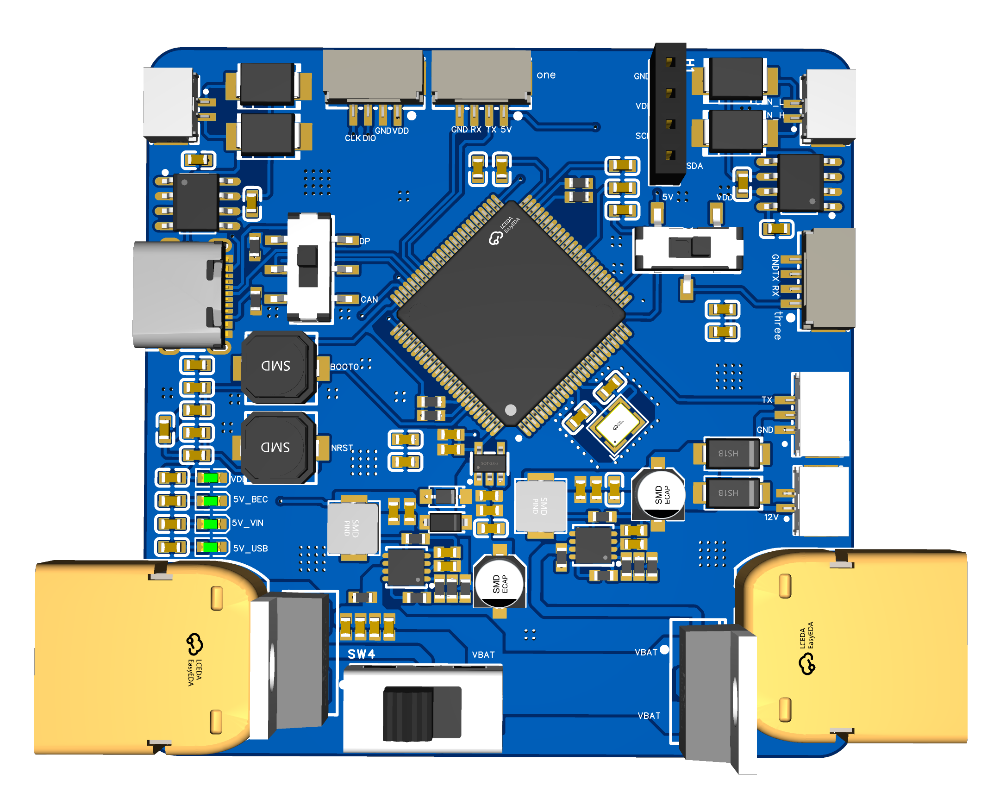
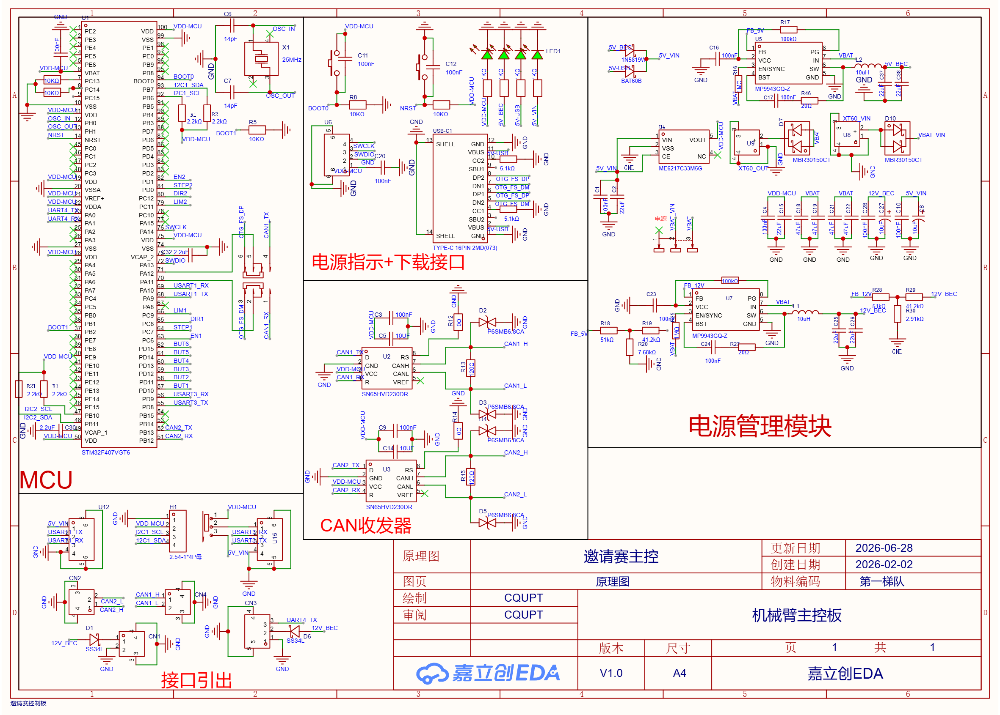

# STM32 底层控制器与硬件设计

**English:** [README.en.md](README.en.md)

本目录包含工业机械臂安全协作系统的 **STM32 底层嵌入式主控系统**，涵盖定制控制板硬件电路设计（立创 EDA 工程与原理图）以及基于 STM32F407 的实时运动控制固件源码。

---

## 目录索引

- [系统概述](#系统概述)
- [硬件与电气设计](#硬件与电气设计)
  - [3D PCB 效果图](#3d-pcb-效果图)
  - [电路原理图](#电路原理图)
  - [关键硬件规格与接口](#关键硬件规格与接口)
- [固件软件架构](#固件软件架构)
  - [核心模块划分](#核心模块划分)
  - [时钟树与中断优先级](#时钟树与中断优先级)
- [通信协议规范](#通信协议规范)
  - [1. 上位机与 STM32 统一串口协议 (USART1)](#1-上位机与-stm32-统一串口协议-usart1)
  - [2. CAN2 SMD 电机总线协议](#2-can2-smd-电机总线协议)
  - [3. K230 视觉传感器通信协议 (USART3)](#3-k230-视觉传感器通信协议-usart3)
  - [4. 吸盘气泵串口控制协议 (UART4)](#4-吸盘气泵串口控制协议-uart4)
- [安全防护机制](#安全防护机制)
- [开发、构建与烧录](#开发构建与烧录)
- [目录结构](#目录结构)

---

## 系统概述

STM32 底层控制器是整个协作机械臂系统的**确定性执行与硬件安全底座**。上层 ROS 2 规划节点（`ros2/src/main/arm_state.py`）通过高速串口与 STM32 建立双向通信，STM32 负责：
1. **多轴运动控制**：通过 CAN 总线以 500kbps 速率驱动 6 轴 SMD 智能闭环步进驱动器，执行平滑增量轨迹控制。
2. **末端执行器驱动**：通过独立串口与驱动电路控制真空吸盘气泵的抽气与释放。
3. **前端视觉数据汇聚**：通过 DMA 接收并聚合 K230 边缘视觉传感器传来的目标位置坐标流。
4. **底层安全闭环**：实现硬件级通信看门狗、上电零点标定容差校验、重心感知（CoG）运动顺序调度以及硬急停仲裁。
5. **本地状态可视化**：驱动 128×64 OLED 屏幕实时显示关节坐标、通信帧数与系统状态。

---

## 硬件与电气设计

控制板采用专为 6 轴工业机械臂定制的双层 PCB 设计，集成了主控 MCU、多路隔离通信接口及电源管理单元。

### 3D PCB 效果图



### 电路原理图



> **EDA 工程源文件**：`jlc.epro2` 为立创 EDA 专业版（EasyEDA Pro）工程文件，可直接导入立创 EDA 进行二次开发、BOM 导出及 PCB 制板。

### 关键硬件规格与接口

| 模块 / 接口 | 芯片 / 参数 | 引脚分配 | 功能说明 |
| --- | --- | --- | --- |
| **主控 MCU** | STM32F407VET6 (LQFP-100) | - | ARM Cortex-M4 @ 168MHz，512KB Flash，192KB SRAM |
| **CAN 总线** | CAN2 接口 + 差分收发芯片 (500kbps) | PB12 (CAN2_RX), PB13 (CAN2_TX) | 级联驱动 1~6 轴 SMD 闭环步进电机及夹爪 |
| **上位机通信** | USART1 (115200bps, DMA 收发) | PA9 (TX), PA10 (RX) | 对接 ROS 2 / 工控机，传输统一控制帧与状态反馈 |
| **视觉传感器** | USART3 (115200bps, DMA 接收) | PB10 (TX), PB11 (RX) | 接收 Kendryte K230 视觉模块的目标物像素坐标流 |
| **气泵末端** | UART4 (115200bps, DMA 发送) | PC10 (TX), PC11 (RX) | 发送脉冲协议控制真空吸附泵与泄气电磁阀 |
| **状态显示** | I2C1 接口 (400kHz Fast Mode) | PB6 (SCL), PB7 (SDA) | 驱动 0.96 寸 SSD1306 128×64 OLED 调试屏 (I2C 地址 `0x78`) |
| **调试接口** | SWD 调试口 | PA13 (SWDIO), PA14 (SWCLK) | 支持 ST-Link / DAP-Link 仿真与程序烧录 |
| **电源系统** | DC-DC 降压 + LDO 稳压 | - | 支持宽压输入，提供 5V 及 3.3V 独立供电与滤波隔离 |

---

## 固件软件架构

固件位于 [`Control_Code/`](Control_Code/) 目录下，基于 STM32CubeMX 生成的 HAL 库开发，支持 Keil MDK-ARM 编译环境。

```text
Control_Code/
├── Core/
│   ├── Inc/
│   │   ├── main.h               # 全局宏定义与类型声明
│   │   ├── smd.h                # SMD CAN 总线通信协议栈定义 (60+ 功能码)
│   │   ├── K230_UART.h          # K230 视觉传感器多目标解析驱动
│   │   ├── pump.h               # 真空吸盘气泵串口控制驱动
│   │   ├── oled.h               # SSD1306 OLED 显示驱动
│   │   ├── can.h, usart.h, ...  # 各外设 HAL 初始化头文件
│   │   └── tim.h, dma.h, ...    # 定时器与 DMA 接口
│   └── Src/
│       ├── main.c               # 主循环调度、统一协议解析、看门狗与 CoG 调度
│       ├── smd.c                # SMD CAN 协议实现、帧拼接、收发临界区事务锁
│       ├── K230_UART.c          # 视觉目标流解析与 4 目标坐标聚合
│       ├── pump.c               # 气泵指令封装与非阻塞周期刷新
│       ├── oled.c               # OLED 双缓冲显存管理与多格式字体渲染
│       └── ...
├── Drivers/                     # STM32F4xx HAL 驱动库与 CMSIS
├── MDK-ARM/                     # Keil uVision5 工程文件 (test.uvprojx)
└── test.ioc                     # STM32CubeMX 芯片配置工程
```

### 核心模块划分

1. **`main.c`（主控与调度核心）**：
   - 维护上位机 2 秒通信看门狗（`s_last_ok_tick`）。
   - 上电自动执行 `verify_and_capture_zero_offset()`，读取 6 轴绝对编码器脉冲并校准零点偏置。
   - 解析统一串口帧 `U,...*CHK\r\n`，实现角度更新、急停切断、气泵控制与速度倍率切换。
   - 根据当前 J2/J3 姿态执行**重心感知（CoG）运动排序**。
2. **`smd.c` / `smd.h`（SMD 电机 CAN 协议栈）**：
   - 封装 SMD 智能驱动器的 60+ 种功能码（位置/速度/力矩模式、PID、电流读取等）。
   - 具备 `smd_try_lock` / `smd_unlock` 临界区事务锁，防止主循环与中断并发竞争 CAN 总线。
   - 内部集成 CAN 帧接收重组缓冲区，支持多字节大端序组包与校验和校验。
3. **`K230_UART.c`（视觉数据流聚合）**：
   - 使用 USART3 DMA Idle 接收 K230 发送的单目标 `EA,x,yP` ~ `ED,x,yP` 坐标。
   - 自动聚合为标准 8 槽位输出格式 `E<x1,y1,x2,y2,x3,y3,x4,y4>P`，供上层 ROS 2 节点读取。
4. **`pump.c`（吸盘气泵控制）**：
   - 驱动 UART4 通过 DMA 向气泵控制器发送 `#005P2500Tx000!` 指令。
   - 提供 1~9 秒定时模式及持续吸气模式（每 8 秒自动发送 Keep-Alive 刷新）。
5. **`oled.c`（实时状态双缓冲刷新）**：
   - 128×64 像素显存双缓冲，支持 ASCII 字符串、6 轴关节脉冲数值、16 进制/8 进制调试输出。

### 时钟树与中断优先级

- **系统时钟**：外部高速时钟源经过 PLL 倍频至 **168 MHz**（APB1 外设时钟 42MHz，APB2 外设时钟 84MHz）。
- **中断优先级分配（抢占优先级）**：

| 中断源 | 抢占优先级 | 用途说明 |
| --- | :---: | --- |
| **SysTick** | 0 | 1ms 系统时基 |
| **CAN2 RX0** | 0 | SMD 电机数据帧高速中断接收与重组 |
| **USART1** | 0 | 上位机 ROS 2 控制帧 DMA 空闲中断接收 |
| **USART3** | 0 | K230 视觉坐标流 DMA 空闲中断接收 |
| **UART4 / DMA** | 0 | 气泵发送完成中断 |
| **TIM1** | 1 | 1kHz 定时轮询与非阻塞状态机调度 |

---

## 通信协议规范

### 1. 上位机与 STM32 统一串口协议 (USART1)

- **波特率**：`115200 bps`，8 数据位，1 停止位，无校验。
- **传输方式**：DMA 接收 + 空闲中断，环形残留缓冲防丢包。

#### 控制帧格式（ROS 2 → STM32）

```text
U,<DOG>,<p1>,<p2>,<p3>,<p4>,<p5>,<p6>,<STOP>,<PUMP>,<SPEED>*CHK\r\n
```

- **帧头 / 帧尾**：以 `U` 开头，以 `*CHK\r\n` 结尾。
- **字段定义**（共 11 个逗号分隔字段）：
  1. `<DOG>`：看门狗喂狗标志。`OK` 表示正常喂狗；`MM` 表示无操作。
  2. `<p1> ~ <p6>`：6 轴相对目标脉冲值（整型数字），或全部填 `MM`（保持当前位置不变）。
  3. `<STOP>`：停机控制。`CD` 表示硬件紧急停止；`EF` 表示恢复运动；`MM` 表示无操作。
  4. `<PUMP>`：气泵控制。`CPQE` 表示持续开启吸盘抓取；`PUT` 表示释放/关闭气泵；`MM` 表示无操作。
  5. `<SPEED>`：速度倍率百分比（如 `100` 表示 100%，`50` 表示 50%），或 `MM`。

*示例*：
```text
U,OK,0,380000,360000,0,-10000,0,MM,CPQE,100*CHK\r\n   # 运动+吸取+喂狗
U,OK,MM,MM,MM,MM,MM,MM,CD,PUT,MM*CHK\r\n               # 紧急停止并释放吸盘
```

#### 固件身份查询与响应

- **查询（ROS 2 → STM32）**：`Q,ID*CHK\r\n`
- **响应（STM32 → ROS 2）**：`R,ID,stm32-f407-unified-v2-p6*CHK\r\n`

#### 确认回显（STM32 → ROS 2）

当 STM32 成功解析并执行角度命令后，回传当前 6 轴相对脉冲快照：
```text
OK <p1>,<p2>,<p3>,<p4>,<p5>,<p6>\r\n
```

#### 兼容模式指令（Legacy ASCII）

| 指令格式 | 说明 |
| --- | --- |
| `A<p1>,<p2>,<p3>,<p4>,<p5>,<p6>B` | 6 轴增量脉冲控制（帧头 A，帧尾 B） |
| `OK` | 独立喂狗心跳刷新 |
| `CD` | 立即停止所有电机并响应 `OK\r\n` |
| `EF` | 各轴移动至当前实际编码器位置 |
| `S<num>Q` | 设置运行速度百分比（例如 `S100Q`） |

---

### 2. CAN2 SMD 电机总线协议

- **CAN ID**：`0x1000`（扩展帧 29-bit）
- **波特率**：`500 kbps`

```text
 0      1       2       3  ...  N-2        N-1
+------+------+------+-----+-----+------+------+
| 0xC5 | addr | func |  payload  | chk  | 0x5C |
+------+------+------+-----+-----+------+------+
  HEAD                              checksum  TAIL
```

- **帧头/尾**：`0xC5` / `0x5C`。
- **校验算法**：从 `HEAD` 到校验位前一个字节的所有字节累加和低 8 位。
- **电机地址**：`1` ~ `6` 对应机械臂关节 1 至 6，`7` 对应智能夹爪。
- **数据字节序**：多字节整型采用**大端序 (MSB First)**。

---

### 3. K230 视觉传感器通信协议 (USART3)

- **输入格式（K230 → STM32）**：`E<类别>,<x>,<y>P`，例如 `EA,320,240P`。
- **聚合输出格式（STM32 内部聚合）**：
  ```text
  E<Ax>,<Ay>,<Bx>,<By>,<Cx>,<Cy>,<Dx>,<Dy>P
  ```
  自动将 A、B、C、D 四类识别目标的像素坐标汇总为 8 参数帧，供上位机手眼标定与逆运动学节点（`ik_control`）解算。

---

### 4. 吸盘气泵串口控制协议 (UART4)

- **控制指令**：`#005P2500T<time>!`
  - `<time>` 设为 `9000`：持续吸气模式（STM32 内部每 8 秒自动保活）。
  - `<time>` 设为 `1000` ~ `9000`：定时吸附 1~9 秒。
  - 指令 `PUT`：停止气泵供电并释放负压。

---

## 安全防护机制

1. **硬件级通信超时看门狗**：
   - 主循环持续计时，若超过 **2000ms** 未收到有效的上位机统一指令或 `OK` 心跳帧，立即强制切入硬件急停（`s_emergency_stop = 1`），停止所有关节输出并报警。
2. **上电零点标定与偏差校验**：
   - 固件启动后自动通过 CAN 读取各关节绝对位置作为软件偏置。
   - 严格比对偏置是否在容差范围（默认 ±500 脉冲）内，若超出则自动延迟 200ms 重试（最多 3 次），杜绝上电异常位姿直接使能引发的碰撞。
3. **重心感知（CoG）运动顺序调度**：
   - 通过计算电机 2（肩部）与电机 3（肘部）的绝对脉冲和，评估机械臂当前重心的外伸程度。
   - **外伸运动**：先移动底座与内关节，再展开外关节，保证基座稳定。
   - **收缩运动**：优先回收外关节与末端，底座最后归位，显著降低悬臂倾覆力矩。
4. **CAN 临界区并发保护**：
   - 采用 `smd_try_lock()` / `smd_unlock()` 原语，在开关全局中断的环境下保护 CAN 发送寄存器与序列号队列，彻底消除主循环与定时器/DMA 中断的数据竞争。

---

## 开发、构建与烧录

### 开发环境要求
- **IDE**：Keil MDK-ARM v5.30 及以上
- **配置工具**：STM32CubeMX v6.10+（工程文件：`Control_Code/test.ioc`）
- **固件库**：STM32F4xx HAL Driver V1.8.0+
- **硬件仿真器**：ST-Link V2 / DAP-Link / J-Link

### 编译与下载步骤
1. 使用 Keil 打开工程：
   ```text
   Control_Code/MDK-ARM/test.uvprojx
   ```
2. 在 Keil 中点击 **Rebuild All Target Files** (`F7`) 编译工程。
3. 将 ST-Link 连接至主控板 SWD 调试端子（`3V3`, `SWDIO`, `SWCLK`, `GND`）。
4. 点击 **Download** (`F8`) 烧录固件到 STM32F407 芯片。
5. 上电后，OLED 屏幕将显示固件初始化信息及 6 轴初始脉冲状态。

---

## 目录结构

```text
STM32/
├── 3D_PCB1_2026-06-28.png        # 控制板 3D 渲染与器件布局图
├── SCH_2026-06-28.png            # 控制板完整电路原理图
├── jlc.epro2                     # 立创 EDA 专业版 PCB 原理图/PCB 格式工程
├── README.md                     # 本文档（STM32 底层系统说明）
└── Control_Code/                 # STM32 固件源码工程
    ├── Core/                     # 用户应用层源码与头文件
    │   ├── Inc/                  # 头文件 (smd.h, K230_UART.h, pump.h, oled.h...)
    │   └── Src/                  # 源码 (main.c, smd.c, K230_UART.c, pump.c...)
    ├── Drivers/                  # STM32 HAL 与 CMSIS 库文件
    ├── MDK-ARM/                  # Keil uVision 工程与编译脚本
    ├── test.ioc                  # STM32CubeMX 硬件管脚与时钟配置文件
    └── README.md                 # 固件子目录详细技术说明
```
